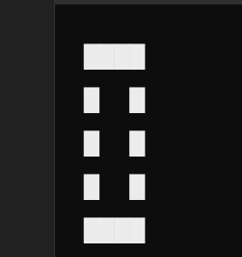

# CHIP-8

Neutral news: for nostalgic reasons, I want to create a Gameboy emulator.

Bad news: I don't know the heads or tails of how to program an emulator.

r/EmuDev recommends the Chip-8 as the gateway drug of choice for emulator development. So here I am, journaling my journey.

Please bear with me and feel free to point out the inevitable holes in my knowledge, glaring or otherwise.

## What is Chip-8?

Ok, this question led me down a rabbit-hole. But I came out on the other side knowing more than I did before. 

The Chip-8 is not an actual gaming console hardware like the Gameboy. The Chip-8 is an interpreted language. What we are writing is actually an interpreter for the Chip-8.

The f, right? Hold tight.

-  Compiled language: C is compiled to assembly and assembly is then translated to machine instructions which are run directly on the hardware.

- Interpreted language: The instructions are translated to _bytecodes_, each bytecode maps to certain instructions, these instructions are then run.

### More on compiled languages
```
C is compiled to assembly and assembly is then translated to machine instructions which are run directly on the hardware
```
1. When we think of C running on an x86 family processor, it requires a compiler that will convert it to x86 assembly and an assembler that will convert x86 to machine opcodes.

2. My understanding is that assembly instructions have an opcode equivalent one-to-one some time and sometime more than one opcode for one assembly instruction. An opcode is an instruction code in raw binary. For e.g. MOV translates to B6 (just as an example)


### More on interpreted languages

```
The instructions are translated to _bytecodes_, each bytecode maps to certain instructions, these instructions are then run.
```

1. Bytecodes are generated or they already exist. For e.g. in case of Chip-8, we are sort of already writing the bytecode itself.

2. The _interpreter_ interprets these. This means mapping bytecodes to routines. Now the thing is, these routines can be in a high-level language, they can be directly machine code, they can be in assembly - anything.

3. Assuming I write a Chip-8 interpreter in Go. Chip-8 instructions will be mapped to Go instructions which in turn will go through the Go code execution process, whatever that is - before being executed on the machine.

4. No wonder interpreted languages are slower because of this overhead. Not only are they interpreting but also potentially compiling post that and running. Worse, they might even be interpreting again and then compiling and then running, if the interpreter itself is written in an interpreted language.

5. This also means that an interpreter for an interpreted language can be written in anything. A Chip-8 interpreter can be written in Go, C, assembly anything. Portability is a side effect of the language being interpreted!


### Back to Chip-8

So what is Chip-8? I would say it is an interpreted language or maybe bytecode.

I will be writing a Chip-8 interpreter in Go.

Chip-8 will have a limited set of instructions - each Chip-8 instruction will be mapped to Go instructions.

So what does it mean when someone says?

- Chip-8 has x registers

- Chip-8 has 4096 KB of RAM

- Etc


Think of it like: We are defining a make-believe environment with constraints. Whatever the underlying hardware be, Chip-8 will work with these constraints. You can have a CPU with 8GB RAM, but the Chip-8 emulator you are writing will be constrainted to 4KB - perhaps as a simple array in Go.

Strictly speaking, this virtual hardware is not necessary and I don't think similar constraints are placed on an interpreted language like Python or Javascript.

We now move on to different parts of Chip-8

## Fonts
```
The CHIP-8 emulator should have a built-in font, with sprite data representing the hexadecimal numbers from 0 through F. Each font character should be 4 pixels wide by 5 pixels tall.

The font most people use is represented in bytes like:

0xF0, 0x90, 0x90, 0x90, 0xF0, // 0
0x20, 0x60, 0x20, 0x20, 0x70, // 1
```

What the hell does that even mean?

Consider 4 pixels wide by 5 pixels tall as 5 rows and 4 columns.

So zero would be

0xF0 = 1111 0000 <br>
0x90 = 1001 0000
and so on <br>
Look at it in the canvas of a black and white screen

IGNORE the second nibble - one nibble is enough to represent the row.



## Corrections to the chip-8 guide

- Not mentioned if chip-8 is big endian or little endian, which it should. It is big-endian btw.